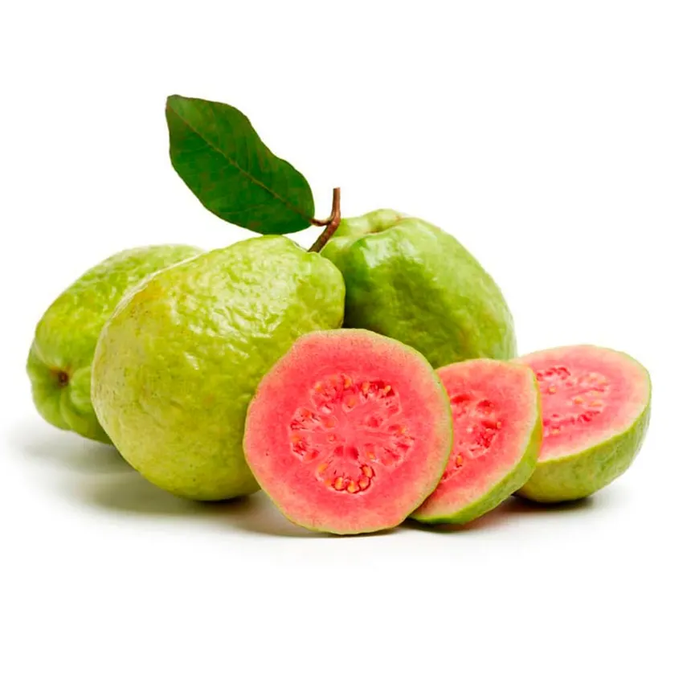

<p align="center">
  <picture>
    <source media="(prefers-color-scheme: dark)" srcset="../brand/logo-horizontal-dark.png">
    
  </picture>
</p>

<h1 align="center">GuavaLink</h1>

<p align="center">
  <strong>Del campo a cada embarque.</strong><br>
  Una operación de empaque de guayaba más clara, conectada y trazable.
</p>

<p align="center">
  Prototipo de interfaz · Web y móvil · Datos de demostración
</p>

---

## ¿Qué es GuavaLink?

GuavaLink busca digitalizar el trabajo de un **empaque de guayaba de exportación**. Su objetivo es reunir en un mismo flujo a productores, personal de recepción y administración: desde el origen de la fruta y su llegada al empaque hasta los embarques, pagos y reportes.

La propuesta contempla una experiencia web para la oficina y una experiencia móvil para el campo y el patio de recepción. En una etapa posterior, ambas compartirán información mediante una API y una base de datos centralizada. Este repositorio contiene **el prototipo de la interfaz**, desarrollado como una aplicación Expo que puede ejecutarse en web y dispositivos móviles.

<p align="center">
  
</p>

## Para quién está pensado

| Rol | Experiencia prevista | Qué necesita hacer |
| --- | --- | --- |
| **Administrador** | Web y tablet | Consultar indicadores; gestionar productores, huertas, embarques, pagos, reportes y accesos. |
| **Empacador / recepción** | Móvil | Identificar productores, registrar cajas y kilos recibidos, anotar incidencias y relacionar entregas con embarques. |
| **Productor** | Móvil | Mostrar su código QR y consultar entregas, pagos y avisos. |

## Qué incluye el prototipo

El acceso de prueba reconoce tres correos y abre una vista distinta para cada rol. La vista administrativa tiene un menú adaptable a escritorio y móvil; las vistas de productor y empacador son resúmenes iniciales que se ampliarán conforme avance el proyecto.

| Área | Disponible ahora |
| --- | --- |
| **Inicio de sesión** | Selección de rol mediante cuentas ficticias y regreso al login al cerrar sesión. |
| **Resumen administrativo** | Indicadores, gráfica de recepción y embarques de ejemplo. |
| **Productores** | Consulta, búsqueda y formularios de registro y edición con estado local. |
| **Huertas** | Registro, consulta y ubicación de huertas; mapa interactivo en web y representación simplificada en móvil. |
| **Embarques** | Consulta, formularios y cambio de estado con datos locales. |
| **Pagos** | Consulta, formularios y marcado de pagos realizados con datos locales. |
| **Reportes** | Reportes de ejemplo exportables como CSV. |
| **Usuarios y roles** | Interfaz de gestión local para cuentas de demostración. |

> **Estado actual:** no hay autenticación real, base de datos ni sincronización. Los cambios hechos en la interfaz son temporales y pueden reiniciarse al cambiar de sección o recargar. Las cuentas del módulo «Usuarios y roles» todavía no controlan el acceso al login.

## Probar los tres roles

En el login puedes elegir uno de estos correos. **Cualquier contraseña no vacía** permite entrar durante esta demostración; no uses una contraseña personal.

| Correo | Vista que abre |
| --- | --- |
| `admin@gmail.com` | Panel de administración |
| `productor@gmail.com` | Vista inicial del productor |
| `empacador@gmail.com` | Vista inicial del empacador |

Un correo diferente muestra un aviso. La asignación de rol está definida temporalmente en [`src/data/demo-accounts.ts`](src/data/demo-accounts.ts); más adelante deberá venir del servicio de autenticación.

## Ejecutar el proyecto

Necesitas **Node.js** y **npm**. Desde la carpeta `GuavaLink`:

```bash
npm ci
npm run web
```

Para iniciar Expo y elegir otro destino de desarrollo:

```bash
npm start
```

Comprobaciones disponibles:

```bash
npx tsc --noEmit
npm run lint
```

La revisión completa de lint todavía señala un error previo en `src/hooks/use-color-scheme.web.ts` y advertencias en los componentes del mapa.

## Organización del código

```text
GuavaLink/
├── assets/                  Imágenes usadas por la aplicación
├── src/
│   ├── app/                 Entrada y configuración de Expo Router
│   ├── components/          Mapa, gráfica, iconos y vistas compartidas
│   ├── data/                Cuentas ficticias para probar los roles
│   ├── screens/             Login y secciones de cada rol
│   ├── styles/              Estilos de las vistas
│   └── types/               Tipos compartidos
└── README.md
```

La marca completa está en [`../brand/`](../brand/README.md). El símbolo **G con hoja** y los verdes identifican a GuavaLink; la interfaz actual utiliza superficies oscuras y acciones azules para mantener el contenido legible.

<p align="center">
  
  &nbsp;&nbsp;&nbsp;
  
</p>

## Próximas etapas

1. **Autenticación y permisos reales:** identificar a cada usuario mediante un backend y mostrar las funciones correspondientes a su rol.
2. **Datos compartidos:** conectar productores, huertas, recepciones, embarques y pagos a una API y una base de datos centralizada. La propuesta técnica considera InsForge y PostgreSQL.
3. **Flujo de recepción:** generar y escanear el QR del productor; registrar cajas, kilos e incidencias desde el móvil.
4. **Trazabilidad:** relacionar cada recepción con su huerta, productor, embarque y pago.
5. **Seguimiento:** historial y avisos para productores; reportes y exportaciones más completos para administración.

El alcance original y los criterios de diseño se describen en el [brief de GuavaLink](../GuavaLink_Brief_Diseno.md) y la [propuesta del proyecto](../Propuesta_Proyecto_GuavaLink_Sinmodificar.docx).
